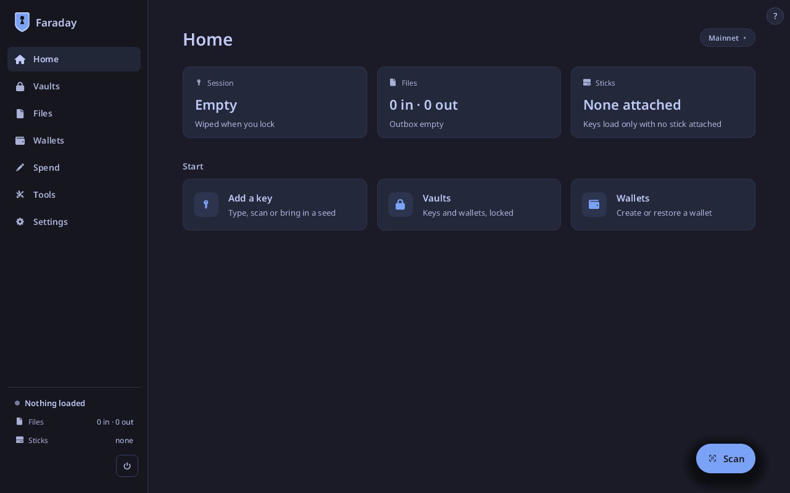
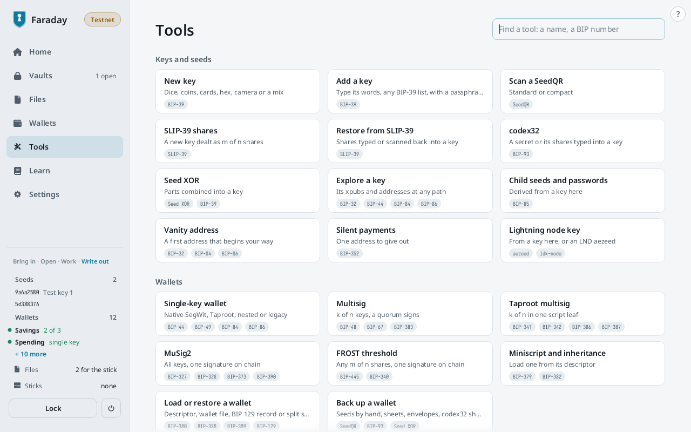
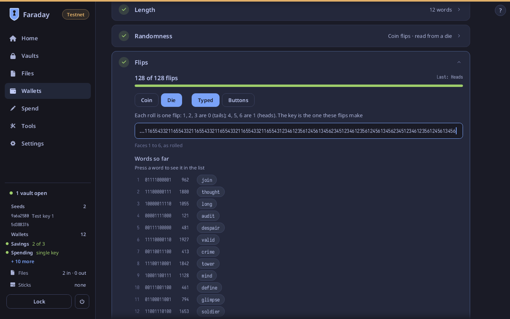
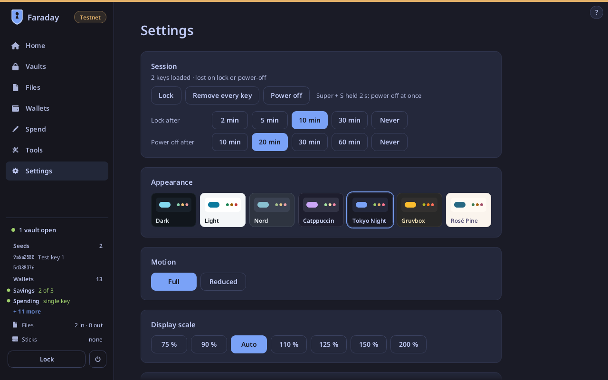
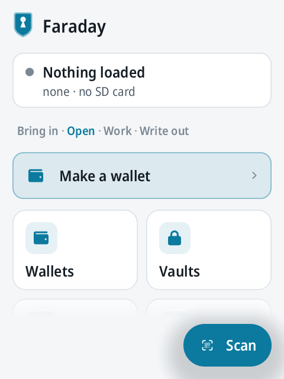
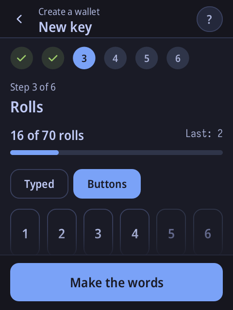
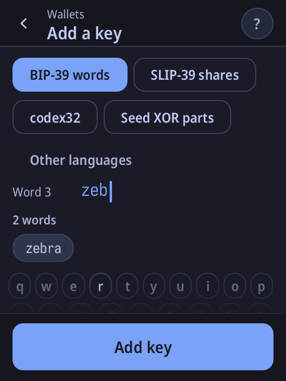
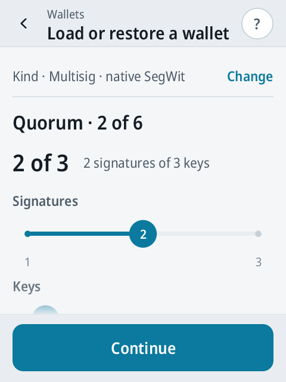

# Faraday

Faraday is an offline key appliance. It boots from a USB stick on an
x86-64 UEFI PC, or from its SD card on a Raspberry Pi, runs entirely from
RAM, and keeps nothing when it powers off. It holds Bitcoin keys,
wallets, passwords, GPG keys and Secure Boot keys in encrypted vaults and
signs with them on a machine that has no network.

Faraday is a fork of OpenSignerKit / OpenSigner and uses its library
crates for every piece of Bitcoin cryptography.

> **Use at your own risk.** Faraday is not reviewed. 0.1.0 is a
> pre-release: no one outside the project has reviewed its code, its
> cryptography or its builds, and no second builder has reproduced it.
> It comes with no warranty of any kind (see `LICENSE`). Check a
> download as [Verifying a release](#verifying-a-release) says before
> using it.

**Reviews and feedback are wanted.** Read the code, boot an image, try
the flows, and say what you find in an
[issue](https://github.com/bitcoinpasada/faraday/issues): a bug, a
screen that is unclear, a flow that leads nowhere, or a claim in
[Security model](#security-model) or [Auditing
Faraday](#auditing-faraday) that does not hold. Where to start reading
is in [Auditing Faraday](#auditing-faraday).

## What it does

| Area | Jobs |
|---|---|
| Vaults | Create a passphrase-encrypted vault; unlock it after the boot stick is removed; hold Bitcoin keys, wallets, notes and recovery sheets, password entries with TOTP secrets, GPG keys and Secure Boot keys; seal it and write it back to a stick. |
| Wallets | Wallet creation, restore, backup and spending flows, built on OpenSigner's library crates. |
| GPG | Create an Ed25519 certification key with an Ed25519 signing subkey, export the public certificate, make detached signatures, make a revocation certificate, renew expiry, write a paperkey backup. |
| Secure Boot | Generate PK, KEK and db keys and certificates, write enrolment files, sign and check `BOOTX64.EFI`. |
| QR | One scanner and one sender: fountain-coded `ur:bytes`, BBQr, and the `faraday-file-v1` envelope for any file. |
| Settings | Theme, display scale, reduced motion, idle lock and power-off times, kept on the boot stick between sessions. |

## Screens

The stick image on a PC, at 1280×800.

<table>
<tr>
<td></td>
<td></td>
</tr>
<tr>
<td>Home</td>
<td>Tools: every flow, with its standards</td>
</tr>
<tr>
<td></td>
<td></td>
</tr>
<tr>
<td>A new BIP-39 key from die rolls: each word's bits and the word</td>
<td>Settings</td>
</tr>
</table>

The Raspberry Pi image on its 2.8 inch panel, at 480×640, worked by
touch.

<table>
<tr>
<td></td>
<td></td>
<td></td>
<td></td>
</tr>
<tr>
<td>Home</td>
<td>A new key from dice rolls</td>
<td>Add a key: typing a seed's words</td>
<td>Restore: 2 of 3</td>
</tr>
</table>

## Starting a session: the boot import

The boot stick's data partition can carry what a session needs: vaults,
wallet descriptors, PSBTs, seed words, pictures of QR codes. Faraday
reads it once, when it first sees the stick after power-on, and does
not leave it attached while anything secret is open.

1. **Copied into memory.** Every file on the stick is read into RAM. A
   vault file goes into the Inbox, still encrypted. Every other file is
   held apart from the Inbox until the import. A PNG is not kept as a
   picture: its QR codes are read, and what they hold is kept, a SeedQR
   as its seed words. A file Faraday reads as nothing it knows, up to
   18 MiB, is kept as a File, which can go to the Inbox to be signed
   with a GPG key or sent as QR codes. A sheet says how many files were
   copied and what they are, and asks for the stick to be removed.
2. **Remove the stick.** Keys never load and passphrases are never typed
   while a stick is attached. Once it is out, the sheet lists what the
   files hold.
3. **Unlock the vaults wanted.** Each vault from the stick has an
   Unlock button. Unlocking opens the usual passphrase screen and comes
   back to the sheet, which then lists the vault's wallets and keys too.
4. **Choose.** The sheet lists every wallet found in the files, the
   pictures and the open vaults, once each, ticked: its name, its shape,
   whether the keys present can sign for it ("Can sign", "1 of 3 keys
   here · 1 more needed", or "Watch-only"), and the files that carry it
   and its keys. Keys that no wallet listed uses follow, ticked. Then
   every file, for the Inbox: PSBTs and vaults ticked, everything else
   not, and an open vault's file always kept.
5. **Import.** One press loads the chosen wallets with their keys and the
   chosen keys, moves the chosen files into the Inbox, and wipes
   everything else from memory. A file not chosen is still on the stick;
   bringing it in later means inserting the stick again, for an ordinary
   stick visit. The session goes on from Home with the wallets and keys
   loaded.

**Import later**, or a tap beside the sheet, leaves the copied files
waiting in memory and goes to Home; the Sticks row in the sidebar, the
Sticks card on Home and the import card on Home open the sheet again.
Locking wipes whatever was not imported. A later insertion of the boot
stick in the same power-on is an ordinary stick visit; the desktop app's
test stick (F2) stands for the boot stick, so its first plugging in a
session runs the import.

## A second stick for storage

On a PC, any other USB stick can carry files to and from Faraday. It is
read and written on an ordinary stick visit, never at the boot import,
and only while no vault is open ([Security model](#security-model)).
Format it like this:

- **A partition table**, MBR or GPT, with the files in a partition. A
  filesystem written to the whole device with no partition table (what
  `mkfs.fat /dev/sdX` makes) is not seen: Faraday only ever opens
  partitions.
- **FAT32 or FAT16.** exFAT, NTFS, ext4 and APFS are not read, and
  neither is FAT12. Sticks larger than 32 GB usually come formatted
  exFAT and need reformatting; most smaller ones come as MBR and FAT32
  and work as they are.
- **Any label except `OSKBOOT`**, which marks a boot partition and is
  never opened.
- **Files at the top level.** Files inside folders are not read. The
  largest file read is 18 MiB.

On Linux, with the stick at `/dev/sdX` (check with `lsblk` first; this
erases the stick):

```
sudo parted --script /dev/sdX mklabel msdos mkpart primary fat32 1MiB 100%
sudo mkfs.fat -F 32 -n FARADAY /dev/sdX1
```

On macOS, with the stick at `/dev/diskN` (check with `diskutil list`):

```
diskutil eraseDisk FAT32 FARADAY MBRFormat /dev/diskN
```

On Windows, Explorer's Format offers FAT32 only for 32 GB or less; for a
larger stick, use Disk Management to make a partition of 32 GB or less
and format it FAT32.

The Raspberry Pi image reads no USB stick: its kernel has no USB storage
driver, and the SD card it boots from is its only storage.

## Choosing a computer

A laptop is the better machine for the stick image. Its screen,
keyboard and touchpad are inside the case: nothing outside it sees the
screen, and Faraday takes input from them without asking.

On a desktop PC, the monitor cable carries everything Faraday shows:
seed words, keys as QR codes, and the code typed to approve a new
keyboard. A plain monitor is fine. Avoid anything on the other end of
the cable that can record or send on what it shows:

- smart TVs, and monitors with network, casting or screenshot features;
- capture cards and recorders;
- KVM switches, and above all network KVMs. A network KVM both sees the
  screen and acts as a USB keyboard, so it can read the approval code
  and type it, and then operate Faraday from elsewhere.

Faraday's kernel has no Wi-Fi or Bluetooth driver, so a laptop's radios
stay off whatever card it has. Taking the card out as well means nothing
can turn them on, whatever runs on the machine. Cheap laptops whose
Wi-Fi and Bluetooth are on a separate card, in an M.2 or mini PCIe slot
behind a screwed panel, are widely available, used business models
especially.

## Security model

### One program, not a desktop

What is on the screen is not a desktop environment. There is no X11, no
Wayland, no window manager, no GPU driver, no toolkit and no browser
engine. The firmware sets up a framebuffer, the kernel hands it over, and
Faraday, one Rust program, lays out every screen, rasterises its own
fonts and writes the pixels into that framebuffer. Keys, clicks and
touches arrive as raw kernel input events, read per device.

The whole running system is the Linux kernel, BusyBox init with a short
boot script, and three Rust programs:

| Program | Runs as | Does |
|---|---|---|
| `faraday` | its own unprivileged user | The application. Holds every secret. |
| `faraday-disk` | a second unprivileged user | Reads and writes FAT on sticks and cards. Holds no key or passphrase: files pass through it to and from a stick, and are wiped once passed. Cannot read the application's memory or files. |
| `faraday-grant` | its own user, with `CAP_CHOWN` only | Hands a stick's partitions to `faraday-disk` and authorises USB interfaces, deciding from `/sys` alone. Reads nothing from a stick. |

No process can trace another, and each user's processes are invisible
to the others in `/proc`.

### When root is used

- **At boot.** The kernel starts BusyBox init as root. The boot script
  mounts `/proc`, `/sys` and `/dev` with nothing on them executable,
  sets the kernel's ptrace restriction, hides kernel addresses, sets the
  USB authorisation policy, creates the RAM directories and pipes the
  programs use, and starts the three programs. It mounts no storage.
- **`faraday-grant`** starts as root and, before it reads anything,
  drops to its own user keeping only `CAP_CHOWN`, empties its capability
  bounding set and sets no-new-privileges.
- **After boot**, the root processes are init and two shell loops: one
  restarts the application under its user each time it locks, the other
  restarts `faraday-disk` under its user if it exits. When the
  application ends, init powers the machine off. None of these reads
  anything from a stick, a camera, a keyboard or a file.
- **Nobody can become root.** There is no login prompt, no getty, no
  `su`, `sudo` or `passwd`, and root's password is locked. Every process
  that handles input runs as an unprivileged user under
  no-new-privileges.

The development image (`just dev=1 faraday-stick-image`, a separate
file ending in `-dev.img`) adds a root login on the serial port for
debugging. It is not a release image.

### What the kernel can reach

The kernel is built with a fixed list of drivers and no loadable
modules. Each board has a `kernel.forbidden` and a `kernel.required`
list, and the build fails if a forbidden option is on or a required one
is off. The required list includes the kernel's own defences: it
randomises and checks its heap, and stops on detected corruption or an
internal error rather than carrying on.

- **No networking.** The network stack is not compiled in: no Ethernet,
  Wi-Fi, Bluetooth or USB network adapter has a driver, and there is no
  socket layer for one to use.
- **No internal storage.** On a PC the SATA, NVMe and eMMC drivers are
  not built, so the computer's own disk is invisible: it cannot be read,
  written or mounted. The firmware variable filesystem is not built
  either.
- **Removable storage, by platform.**

  | | PC | Raspberry Pi |
  |---|---|---|
  | USB stick | Yes | No: the kernel has no USB storage driver |
  | SD card | Only in a USB card reader that presents itself as USB mass storage. A built-in SD slot is not read: its driver is the one many laptops use for their internal eMMC disk. | Yes, its own slot |
  | Keyboard and pointer | Built-in keyboard, touchpad and touchscreen, and USB | The touch panel only: the kernel has no HID driver |
  | Camera | USB webcam | Pi camera or USB webcam |

- **Why the stick comes out.** Nothing reaches a stick except through
  a stick visit, which writes only what the Outbox holds, and only while
  nothing secret is open. Pulling the stick does not add that rule; it
  takes away the means to break it. With no stick attached, no fault in
  Faraday can write a secret to one, and a hostile stick has nothing to
  attack while a key or passphrase is in memory. A secret reaches a
  stick only sealed inside a vault, or unencrypted if the person asks
  for that. Faraday warns that anyone with the stick will be able to
  read it, and asks again before writing it.
- **Removable storage behind a boundary.**
  - The kernel parses no filesystem from a stick or card; it has no FAT
    driver. `faraday-disk` reads and writes FAT in Rust, as an
    unprivileged user.
  - Partitions are handed out one at a time. A whole-disk device is never
    handed out, and neither is the boot partition, so the running system
    cannot modify its own kernel.
  - No removable storage is accessible while any secret is in memory.
    The boot stick comes out before a vault is unlocked. To write a vault
    back, Faraday seals it and restarts the application, and the stick
    goes in only after that.
- **A stick plugged in while a vault is open.** Two separate parts
  refuse it, so a fault in one does not open the stick:
  - `faraday-grant` hands a partition to `faraday-disk` only while the
    application has published that it holds no secret. With a vault
    open, the partition device stays root's and mode `0600`, and no
    Faraday process can open it. If the application stops being clean,
    every partition already handed out is taken back.
  - The application shows **A stick is attached · nothing has been read
    from it** with two choices: **Not now**, which leaves the stick
    untouched, and **Lock and use stick**, which locks (below) before
    the stick is read. While a stick is attached, passphrase fields take
    no typing and no key is loaded.

  What the kernel does read from such a stick is its USB descriptors and
  its partition table. Its storage interface is the only one authorised,
  so a stick that also claims to be a keyboard types nothing.
- **USB devices.** On a PC the kernel has drivers for mass storage,
  keyboards and pointers, webcams and hubs; on a Pi, for webcams and
  hubs. Nothing else has a driver. Interfaces are authorised one at a
  time: a device with a storage interface gets only that interface, so a
  stick that also claims to be a keyboard is never authorised as one. A
  keyboard other than the computer's built-in one is ignored until it
  types a random code shown on the screen; a new pointer is ignored until
  a person approves it with trusted input.
- **Also absent:** swap, suspend, hibernation, core dumps, `/dev/mem`,
  `/proc/kcore`, kexec, debugfs, BPF, kernel probes and tracing,
  io_uring, asynchronous I/O, System V IPC, the kernel keyring, one
  process reading another's memory, and Thunderbolt PCIe tunnelling. On
  a PC also the 32-bit system calls, raw HID access, virtio, the CD-ROM
  driver and the vendor-specific keyboard and mouse drivers. Kernel
  lockdown is forced to its strictest level from early boot, which
  closes whatever interface remains for a process to read or write
  kernel memory or raw hardware. The IOMMU is on from boot in strict
  mode.

### Stateless

- The root filesystem is linked into the kernel image. The firmware loads
  that one file into RAM, and nothing is mounted from the boot medium
  afterwards.
- Nothing is written to the computer. There is no driver for its disk
  and no access to its firmware variables.
- **What locking wipes, and how.** Locking seals every open vault into
  the Outbox and then clears memory in two steps:
  1. The application drops every key, seed, passphrase and decrypted
     record it holds. Each is kept in a type that overwrites its memory
     with zeros when it is dropped (the `zeroize` crate's volatile
     writes, which the compiler cannot optimise away). Typed words and
     passphrases are kept in a buffer that also wipes the old copy
     whenever it has to grow, and files from a stick are wiped on their
     way through the disk process, which outlives each lock.
  2. The application process then exits and a fresh one starts. The
     kernel overwrites every page a process frees with zeros before the
     page can be used again, and zeroes it again when it is handed out
     (built into the kernel as its default, and set on the command line
     as well). This also covers copies step 1 cannot reach, such as
     temporary values a library left on the stack.

  Seed-word files and other secret files copied in from a stick are
  removed from RAM at the same time. The Inbox and Outbox, which hold
  only public or encrypted files, are kept for the fresh process.
  Nothing can be paged out first: there is no swap, no hibernation and
  no core dumps.
- **Panic key.** Holding Super and S together for two seconds powers
  the machine off at once, from any screen: the panel goes black, the
  application wipes what it holds as it ends, and nothing is asked or
  saved. Settings shows it beside Power off.
- Powering off loses everything in RAM. What persists is only what is
  written to a stick: sealed vaults, signed transactions, public keys and
  certificates, and `faraday-settings.txt`, the display and idle
  settings, read from the boot stick at the next boot. Nothing read from
  that file can turn off the idle lock or change the network.

### Why not a stripped-down amnesiac Linux

An amnesiac live system makes a general-purpose desktop forget. Its
amnesia is a policy laid over a system that can still reach a network
and a disk. Faraday does not have those capabilities to begin with.
Every component that parses input is attack surface, and Faraday's
complete list of untrusted input fits in one paragraph (`PLAN.md` §4.4).

| | Amnesiac live Linux | Faraday |
|---|---|---|
| What runs | A display server, a desktop, a browser and hundreds of packages | The kernel, init and three Rust programs |
| Network | Stack and drivers present; disabled, firewalled or routed | Not compiled in |
| The computer's own disk | Driver present; the system can mount it | No driver |
| Kernel drivers | Loadable modules for most hardware | A fixed list; no module loading |
| Filesystems on sticks | Parsed by the kernel, often mounted automatically | Parsed by an unprivileged Rust process |
| Administrator access | An optional administrator password, `sudo` | No login, no `su`, no `sudo` |
| USB devices | Any class a driver exists for | Storage, input, camera and hub only, authorised interface by interface; a new keyboard proves a person is at the screen |

**A live system with networking compiled out.** Removing networking
from the kernel removes one subsystem. The rest of the kernel is decided
by the software above it. systemd requires control groups; a graphical
desktop draws through the kernel's GPU driver stack; browser sandboxes
use namespaces and seccomp; mounting a stick needs filesystem drivers in
the kernel. These are where many Linux privilege-escalation bugs have
been found, and they cannot be compiled out without breaking the
programs that need them. Above the kernel, a desktop and a browser bring
in font engines, image decoders, a JavaScript engine, D-Bus, udev and
polkit, all of which parse untrusted data and run as the same user as
the wallet. Faraday's kernel carries only what one program needs, and
the build fails if a forbidden option is turned on. The secrets are in a
process no other program shares a user with.

Faraday still runs the Linux kernel, with its USB, input and camera
drivers, and its own Rust dependencies. A bug in a driver Faraday keeps
is still a risk. What Faraday removes is everything else.

### Vault cryptography

- A vault is one file. Its header (format version, Argon2id cost and a
  random 32-byte salt) is not secret. Everything after it is ciphertext.
- **Key.** Argon2id version 1.3 over the passphrase and the salt, then
  HKDF-SHA256 with a fixed label, gives a 256-bit key. Faraday creates
  vaults with at least 64 MiB of memory and 2 passes; presets go up to
  2 GiB, chosen for the weakest machine that will open the vault.
- **Cipher.** XChaCha20-Poly1305 with a random 24-byte nonce, drawn fresh
  every time the vault is sealed. The header is authenticated as
  associated data, so a changed salt or cost makes the file fail to open
  rather than changing what a guess costs.
- **Fixed size.** The contents are padded to a size chosen at creation,
  from 64 KiB to 4 MiB. The file does not grow as entries are added and
  does not show how much it holds.
- **Limits before work.** A reader checks the stated cost against fixed
  limits before allocating memory, and checks the authentication tag
  before parsing anything inside.
- **Writing back.** A sealed vault is written as a new file, read back
  and compared byte for byte, then renamed over the previous copy.
- **The passphrase is what protects it.** Doubling the Argon2id cost adds
  one bit; one more word from the EFF long list adds 12.9. The built-in
  dice generator makes word passphrases, and a six-word one is 77.5 bits.
- **Readable without Faraday.** The format is published in
  `docs/VAULT.md`, with test vectors in `tools/vectors/vault/`.
  `tools/vault/open.py`, a Python reader over standard libraries, opens a
  vault with no Faraday code.

### Why this construction holds up

The pieces above are chosen so that the usual ways a passphrase-sealed
file goes wrong are absent by construction, not patched after the fact.

- **Standard primitives, used in the standard way.** Argon2id and
  XChaCha20-Poly1305 are the current recommendations for passphrase
  stretching and authenticated encryption, and both come from vetted
  crates rather than anything invented here (`docs/AUDIT.md`). The work
  is in how they are combined; none of it is new cryptography.
- **Memory-hard stretching.** Argon2id makes each guess cost memory as
  well as time, which is what denies an attacker the advantage of
  massively parallel hardware. It raises the floor under a passphrase; it
  does not replace a strong one.
- **Stateless sealing.** A 24-byte nonce is large enough to draw at
  random on every seal with no meaningful chance of collision, so correct
  use needs no counter and no saved state. A frequent source of AEAD
  failures — a reused or mismanaged nonce — cannot arise here.
- **Nothing is compressed before encryption.** Compressing secrets before
  sealing them can leak their content through ciphertext length; this
  format does not, and the fixed slot size means a file's length reveals
  only its size bucket, never how much is stored or what kind of thing it
  is. An unused slot is random bytes, indistinguishable from one in use.
- **Open, not obscure.** The scheme is written down byte for byte, has
  test vectors, and is opened by an independent reader, so its security
  rests on the passphrase and the primitives alone — not on the format
  staying secret, and a vault outlives the program that wrote it.

### What this does not defend against

- A malicious Faraday binary. The defence is reproducible builds, checked
  by people other than the author (below).
- Compromised firmware, hardware implants, and cold-boot attacks on RAM.
- A weak passphrase.

## Auditing Faraday

Faraday is built so that the part that decides what a signature or a
ciphertext is can be read apart from everything that draws screens. The
cryptographic core is a set of library crates with no screens, no input
and no storage in them; the interface calls into them and computes
nothing itself. `docs/AUDIT.md` lists every crate that touches a key,
what it computes, whether the code is written in this tree or taken from
a vetted crate, and what it is checked against.

**Bitcoin cryptography starts upstream.** Every key derivation, mnemonic,
signature, PSBT and message signature is OpenSigner's, in its `core/`
crates (`osk-crypto`, `osk-bip`, `osk-psbt`, `osk-entropy`). Faraday
does not edit them. A Bitcoin signing feature
Faraday needs that OpenSigner lacks is proposed to OpenSigner, built
there, and only then merged here; the one waiting now, signing silent
payment outputs (BIP-375), waits for exactly that. Faraday's own crates
compute only what OpenSigner has no use for, each as a library with no
interface: the vault (`faraday-vault`), OpenPGP (`faraday-pgp`) and
Secure Boot (`faraday-sb`).

Why this is better than one repository and one application:

- **A smaller thing to read.** An auditor of signing reads `core/`:
  libraries with no rendering, layout, fonts or event handling in them.
  `faraday-core` and the shells are flows and wording; a change there can
  change what the person sees and when, never the bytes signed. The two
  layers can be reviewed at different depths, and `docs/AUDIT.md` §5
  draws the line.
- **Checkable as unchanged.** `core/` here is upstream's tree at a
  recorded commit (`HANDOFF.md`, Git state), so a diff against that
  commit shows that Faraday has changed nothing in it. A reviewer who has
  audited OpenSigner's signing has audited Faraday's.
- **Two projects behind one signing path.** OpenSigner's developers,
  its own apps and its users exercise the same code. A signing bug has to
  get past both projects, and a fix made upstream reaches Faraday by the
  same merge.
- **No interface pressure on the cryptography.** A screen that wants a
  value in a new shape gets it from a library function written and
  tested against published vectors, not from a shortcut taken inside a
  view. OpenSigner's rule is that code that defines bytes, or answers a
  question with no screen in it, lives in `core/` (`docs/WALLETS.md` §1
  rule 5).
- **Checked against others.** Each cryptographic crate is tested against
  published vectors (`tools/vectors/`) and independent implementations:
  a Python reader opens Faraday's vaults, `gpg` and `paperkey` judge its
  OpenPGP packets, `openssl` and `sbverify` its Secure Boot output.

`unsafe` Rust is forbidden across the workspace. The exceptions in what
Faraday builds are `osk-crypto` (locking secret pages in RAM), the camera crate
`opensigner-v4l2` (its `ioctl`s), and `faraday-grant` (dropping
privileges); each says why in its crate documentation.

## Build

Prerequisites: stable Rust (see `rust-toolchain.toml`), a C compiler
(`secp256k1-sys` builds libsecp256k1 from source), and on Linux the X11
or Wayland client libraries at runtime, including `libxkbcommon-x11`.

```
# Quick dev build, for iterating: target/debug/faraday
cargo build -p faraday-desktop

# Release build: target/release/faraday
cargo build -p faraday-desktop --release
```

## Run the desktop shell

The desktop shell runs Faraday in a window on an ordinary computer, for
trying the screens. It has none of the protections above. Use it with
test seeds only. It starts on testnet; moving it to mainnet, or loading
a mainnet wallet into it, first shows **Not air-gapped**, which stays
until **I understand** is pressed.

```
./target/release/faraday [--sticks DIR] [--size WxH] [--full-kit]
```

Sticks are folders under `--sticks` (default `~/faraday-sticks`), each
one a USB stick the app can see plugged in or pulled out:

- **F2** plugs in the test stick (a 2-of-3 Taproot multisig's public
  backup files, an unsigned spend, and `vault.ofv`, passphrase `a`,
  holding its three seeds, all testnet), or pulls it out. It stands for
  the boot stick: its first plugging in a session runs the boot import
  (above), and every later one is a stick visit
- **F3** plugs in a blank stick
- **F4** pulls every stick
- **F5** plugs in every folder under `--sticks`

`--full-kit` carries the full test kit on the test stick instead of just
the backup test stick. Every session starts on testnet.

Build the test kit on its own with:

```
cargo run -q -p faraday-testkit -- out/testkit
```

## USB stick image

The image is built with Buildroot in a container (`DOCKER=podman` or
`docker`).

```
just faraday-stick-bin                    # the stick binary, static musl
just faraday-stick-image                  # out/stick/faraday-x86_64-uefi.img
just dev=1 faraday-stick-image            # + a serial console and root login, for development
```

Flash the image to a stick and boot a PC from it; the stick image starts
on mainnet. `faraday/image/run-build.sh` and
`opensigner/shells/pi/image/README.md` describe the image layout.

## Reproducible builds

The stick image is built in a container with the base image and every
compiler pinned by version, the commit date as `SOURCE_DATE_EPOCH`, and
host paths remapped out of the output, so that a second builder can
check that it gets the same bytes. No second builder has checked a
Faraday image yet. The pinned container build of the desktop app
(`just faraday-linux-bin`) is not set up yet.

## Verifying a release

Each release on GitHub has the artifacts, `SHA256SUMS` listing their
SHA-256 sums and the commit they were built from, and `SHA256SUMS.asc`,
a detached signature over it. The release key was made in Faraday and
its secret part has never left a Faraday vault. Its public part is
[`faraday/release-key.asc`](faraday/release-key.asc), and its
fingerprint is:

```
E8A2 E837 7878 F1D0 5D87  CD92 5D84 71D7 F9CF B8C9
```

Import the key, check that `gpg --fingerprint` prints that fingerprint,
then check the signature and the sums of the files downloaded:

```
gpg --import release-key.asc
gpg --fingerprint 5D8471D7F9CFB8C9
gpg --verify SHA256SUMS.asc SHA256SUMS
sha256sum -c --ignore-missing SHA256SUMS
```

The release tags are signed with the same key: `git tag -v v0.1.0`.

## Relationship to OpenSigner

`core/` and `opensigner/` are OpenSignerKit/OpenSigner's tree, kept in
step with the git remote `upstream` by applying its changes; this
repository's history starts fresh and shares none with upstream's.
Faraday uses the `osk-*` crates as a library. `faraday/`
is Faraday itself: `faraday-core`, the desktop and stick shells, the
vault, GPG, Secure Boot and QR code. See `PLAN.md` for the full spec,
`docs/FLOWS.md` for every flow, and `docs/VAULT.md` / `docs/QR.md` for
the vault and QR formats.

## Repository rules

- No GitHub Actions or hosted CI. Everything builds and tests locally.
- Upstream changes are applied from the `upstream` remote
  (`git diff <last> upstream/main`), not copied by hand.
- Nothing under `local/` is committed; use it for private notes.

## License

MIT. See `LICENSE`.
